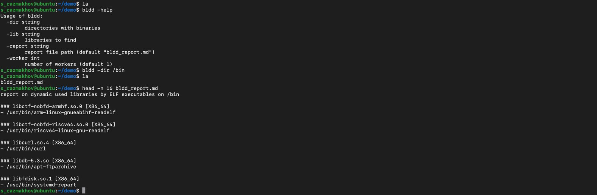

# bldd — backward ldd

`ldd` tells you what libraries a binary needs. `bldd` tells you what binaries need a library.

## usage

```sh
bldd -dir <dirs> [-lib <libs>] [-report <path>] [-worker <n>]
```

```sh
# find all binaries using libc.so.6
bldd -dir /usr/bin -lib libc.so.6

# scan multiple directories, report all libraries
bldd -dir /usr/bin,/usr/sbin

# custom report path with 4 workers
bldd -dir /usr/bin -report deps.md -worker 4
```



### flags

| flag      | default          | description                                       |
|-----------|------------------|---------------------------------------------------|
| `-dir`    |                  | directories to scan (comma-separated)             |
| `-lib`    |                  | libraries to find (comma-separated; omit for all) |
| `-report` | `bldd_report.md` | output report path                                |
| `-worker` | `1`              | concurrent workers                                |

## install

```sh
go install github.com/serasma/bldd/cmd/bldd@latest
```
